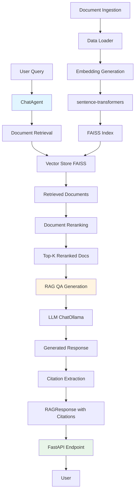

# Agentic RAG Example 

An end to end RAG solution with an evaluation framework. 

## Architecture

This project implements an agentic RAG (Retrieval-Augmented Generation) system using LangGraph for orchestration. The architecture follows a multi-stage pipeline:



### Key Components

- **[`ChatAgent`](src/models/agent.py)**: Orchestrates the RAG workflow using LangGraph StateGraph
- **Vector Store**: FAISS-based similarity search with sentence-transformers embeddings
- **Reranker**: Re-ranks retrieved documents for better relevance
- **LLM**: ChatOllama for local inference with caching via SQLite
- **API Layer**: FastAPI for serving the RAG system

## Project Structure

```
rag-example/
├── src/
│   ├── api/              # FastAPI application
│   │   └── main.py       # API endpoints
│   ├── data/             # Data processing
│   │   ├── data_loader.py    # Document ingestion
│   │   └── embeddings.py     # Embedding generation
│   ├── models/           # Core RAG components
│   │   ├── agent.py      # ChatAgent with LangGraph workflow
│   │   ├── rag.py        # Retriever implementation
│   │   ├── prompt.py     # Prompt templates
│   │   └── schemas.py    # Pydantic models (RAGResponse, Citation)
│   ├── eval/             # Evaluation framework
│   │   └── evaluation.py # DeepEval integration
│   ├── helper/           # Utility functions
│   │   └── utils.py      # Document formatting helpers
│   └── config.py         # Configuration settings
├── data/
│   ├── processed/        # Processed documents
│   │   └── index.faiss   # FAISS vector index
│   └── cache/            # LLM cache
├── main.py               # CLI entry point
├── requirements.txt      # Python dependencies
├── pyproject.toml        # UV project configuration
└── docker-compose.yml    # Docker deployment
```

## What It Does

This RAG system performs the following workflow:

1. **Document Ingestion**: Loads documents (PDF, DOCX, PPTX) using [docling](https://github.com/DS4SD/docling) and generates embeddings via sentence-transformers
2. **Retrieval**: Uses FAISS vector similarity search to find relevant documents for a query
3. **Reranking**: Improves relevance by reranking retrieved documents (configured via `RERANK_TOP_K` in [config.py](src/config.py))
4. **Generation**: Generates answers using ChatOllama with context from reranked documents
5. **Citation**: Extracts source citations with page/slide numbers and relevant text snippets
6. **Evaluation**: Validates response quality using DeepEval metrics

## Usage

### Installation

```bash
# Using UV (recommended)
uv sync

# Or using pip
pip install -r requirements.txt
```

### Setup

1. Create a `.env` file based on [`.env.example`](.env.example):
```bash
cp .env.example .env
```

2. Ensure Ollama is running with your chosen model

3. Ingest documents into the vector store:
```bash
python -m src.data.data_loader
```

### Running the Application


**API Server:**
```bash
uvicorn src.api.main:app --reload
```

The API will be available at `http://localhost:8000` with interactive docs at `/docs`.

**Docker:**
```bash
docker-compose up
```

### Example Query

```python
from src.models.agent import create_agent

agent = create_agent()
response = agent.query("What is in the documents?")

print(f"Answer: {response['generation']}")
print(f"Confidence: {response['confidence']}")
print(f"Citations: {response['citations']}")
```

### Running Evaluations

```bash
python -m src.eval.evaluation
```

Results are saved to [`evaluation_report.json`](evaluation_report.json).

## Future work

1. See if llm client can be abstracted such that any provider can be used.
2. use words in evaluation instead of 1/0.
3. maybe consider expanding reason in evaluation? might not require if we can get business input.